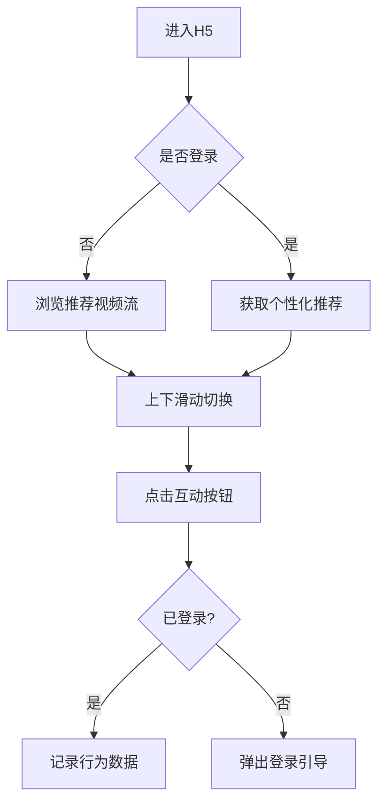

### H5版抖音产品规划方案

#### 一、产品定位
轻量级短视频浏览平台，核心聚焦移动端H5体验，实现抖音核心的短视频浏览、互动功能。

#### 二、核心功能规格
1. **视频流功能**
   - 全屏沉浸式视频播放
   - 无限下滑加载
   - 自动播放（带静音控制）

2. **互动功能**
   - 点赞（带动画效果）
   - 评论弹幕
   - 分享按钮（生成带文案的分享卡片）

3. **用户系统**
   - 微信快捷登录
   - 用户行为记录（点赞历史）

4. **创作者功能**
   - 简易视频上传（限制60s内）
   - 基础滤镜处理

#### 三、技术选型
| 模块        | 技术方案                          | 说明                          |
|-------------|-----------------------------------|-----------------------------|
| 前端框架    | Preact + Swiper.js                | 轻量级React替代方案            |
| 视频处理    | FFmpeg.wasm                       | 浏览器端视频转码               |
| 后端服务    | Node.js (NestJS)                  | 类型友好的框架                |
| 数据库      | MongoDB Atlas                     | 文档型数据库适合内容存储       |
| 部署方案    | Vercel + Serverless Functions     | 自动扩缩容                    |

#### 四、关键用户故事
1. 作为游客，我可以不登录直接浏览视频流，但无法互动
2. 作为用户，登录后可以点赞收藏视频，记录观看历史
3. 作为创作者，可以通过H5页面直接上传手机相册视频
4. 作为分享者，可以生成带小程序码的分享海报

#### 五、体验流程


#### 六、开发里程碑
1. **MVP版本（1周）**
   - 基础视频流渲染
   - 模拟数据接口
   - 核心手势交互

2. **完整版本（2周）**
   - 用户系统对接
   - 真实视频上传
   - 数据分析看板

3. **优化版本（1周）**
   - 首屏加载优化
   - 离线缓存策略
   - 弹幕特效

#### 七、商业价值
1. 通过H5降低用户使用门槛
2. 分享裂变带来自然流量
3. 为后续小程序导流铺垫

需要补充或调整的细节请随时提出，我可以立即输出对应的技术方案文档或原型设计建议。

updateVideoPosition();
                playCurrentVideo();
            }
            
            // 滑动到上一个视频
            function swipeToPrev() {
                if (currentVideoIndex <= 0) return;
                
                currentVideoIndex--;
                updateVideoPosition();
                playCurrentVideo();
            }
            
            // 更新视频位置
            function updateVideoPosition() {
                const offset = -currentVideoIndex * 100;
                videoContainer.style.transform = `translateY(${offset}vh)`;
            }
            
            // 切换播放/暂停
            function togglePlayPause() {
                const currentPlayer = videoPlayers[currentVideoIndex];
                if (currentPlayer.paused) {
                    currentPlayer.play().catch(e => console.log('Play failed:', e));
                } else {
                    currentPlayer.pause();
                }
            }
            
            // 设置动作按钮事件
            function setupActionButtons() {
                document.addEventListener('click', function(e) {
                    const actionBtn = e.target.closest('.action-btn');
                    if (!actionBtn) return;
                    
                    const action = actionBtn.dataset.action;
                    const videoId = parseInt(videoElements[currentVideoIndex].dataset.id);
                    
                    switch (action) {
                        case 'like':
                            handleLike(videoId, actionBtn);
                            break;
                        case 'comment':
                            handleComment();
                            break;
                        case 'share':
                            handleShare();
                            break;
                    }
                });
            }
            
            // 处理点赞
            function handleLike(videoId, actionBtn) {
                if (!currentUser) {
                    showLoginPrompt();
                    return;
                }
                
                const likeIcon = actionBtn.querySelector('.like-icon');
                const countEl = actionBtn.querySelector('.action-count');
                
                if (likedVideos.has(videoId)) {
                    // 取消点赞
                    likedVideos.delete(videoId);
                    likeIcon.classList.remove('liked');
                    countEl.textContent = formatNumber(parseInt(countEl.textContent) - 1);
                } else {
                    // 点赞
                    likedVideos.add(videoId);
                    likeIcon.classList.add('liked');
                    countEl.textContent = formatNumber(parseInt(countEl.textContent) + 1);
                    
                    // 点赞动画
                    likeIcon.style.transform = 'scale(1.5)';
                    setTimeout(() => {
                        likeIcon.style.transform = 'scale(1)';
                    }, 300);
                }
            }
            
            // 处理评论
            function handleComment() {
                if (!currentUser) {
                    showLoginPrompt();
                    return;
                }
                
                alert('评论功能将在完整版中实现');
            }
            
            // 处理分享
            function handleShare() {
                if (navigator.share) {
                    navigator.share({
                        title: '发现一个有趣的短视频',
                        text: '我在轻抖H5上看到了这个视频，分享给你看看',
                        url: window.location.href
                    }).catch(e => console.log('分享失败:', e));
                } else {
                    alert('分享链接已复制到剪贴板');
                    // 实际项目中应该使用Clipboard API复制链接
                }
            }
            
            // 显示登录提示
            function showLoginPrompt() {
                loginPrompt.classList.add('show');
            }
            
            // 隐藏登录提示
            function hideLoginPrompt() {
                loginPrompt.classList.remove('show');
            }
            
            // 显示加载中
            function showLoading() {
                loading.style.display = 'block';
            }
            
            // 隐藏加载中
            function hideLoading() {
                loading.style.display = 'none';
            }
            
            // 微信登录
            wechatLoginBtn.addEventListener('click', function() {
                // 模拟登录成功
                currentUser = {
                    id: 'user123',
                    name: '微信用户',
                    avatar: 'https://randomuser.me/api/portraits/women/10.jpg'
                };
                
                hideLoginPrompt();
                alert('登录成功！');
            });
            
            // 关闭登录提示
            closeLoginBtn.addEventListener('click', hideLoginPrompt);
            
            // 初始化
            showLoading();
            initVideos();
            
            // 监听页面可见性变化
            document.addEventListener('visibilitychange', function() {
                if (document.hidden) {
                    videoPlayers[currentVideoIndex].pause();
                } else {
                    videoPlayers[currentVideoIndex].play().catch(e => console.log('Autoplay prevented:', e));
                }
            });
        });
    </script>
</body>
</html>
```

### 实现说明

1. **核心交互**：
   - 上下滑动切换视频（支持触摸事件）
   - 点击暂停/播放
   - 点赞/评论/分享功能

2. **性能优化**：
   - 使用`will-change`提升动画性能
   - 视频懒加载（实际项目中应实现）
   - 触摸事件节流

3. **移动端适配**：
   - 100vh布局
   - 禁用缩放
   - 视频`playsinline`属性

4. **待完善功能**：
   - 真实API数据对接
   - 视频预加载
   - 手势操作动画优化

5. **扩展建议**：
   - 添加下拉刷新
   - 实现无限滚动加载
   - 增加弹幕功能

这个实现包含了抖音H5版本的核心浏览体验，可以直接在移动端浏览器中运行。需要配合后端API实现完整功能。

